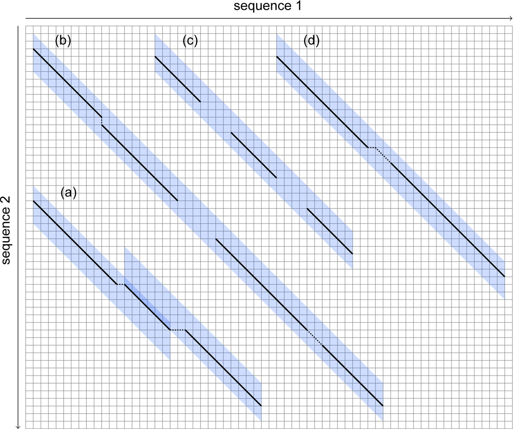

.. sidebar:: ToC

    .. contents::

.. _tutorial-apps-mason:

STELLAR
======

Overview
--------

STELLAR is a tool for pairwise local alignments. It has full sensitivity for :math:`{\epsilon}`-alignements with a maximal error rate and a minimal length. It implements SWIFT filter algorithm and is very practical and fast on very long sequences.   

Algorithm
---------
Filtration
    Rasmussen et al. proved that for any given ε and n0 there exist w, q, e and τ such that every ε-match contains τ q-hits that reside in a w × e parallelogram. A w × e parallelogram is the intersection of e + 1 consecutive diagonals and w + 1 consecutive columns in the dotplot.

Verification

Program options
---------------

Usage: 
  stellar [Options] <FASTA sequence file 1> <FASTA sequence file 2>

  <FASTA sequence file 1>
 
  Set the name of the file containing the database sequence(s) in
  (multi-)Fasta format.  Note that STELLAR expects Fasta identifiers to
  be unique before the first whitespace.
 
  <FASTA sequence file 2>
 
  Set the name of the file containing the query sequence(s) in (multi-)
  Fasta format. All query sequences will be compared to all database
  sequences.  Note that STELLAR expects Fasta identifiers to be unique
  before the first whitespace.

  Without any additional parameters STELLAR compares the query sequence(s)
  to both strands of the database sequence(s) with an error rate of 0.05
  (i.e. 5% errors, an identity of 95%) and a minimal length of 100, and
  dumps all local alignments in an output file named "stellar.gff".

Main options
  [ -e NUM ],  [ --epsilon NUM ]
  
  Set the maximal error rate for local alignments. NUM must be a floating
  point number between 0 and 0.25. The default value is 0.05. NUM is the
  number of edit operations needed to transform the aligned query substring
  to the aligned database substring divided by the length of the local
  alignment. For example specify '-e 0.1' for a maximal error rate of 10%
  (90% identity).

  [ -l NUM ],  [ --minLength NUM ]
  
  Set the minimal length of a local alignment. The default value is 100.
  NUM is the minimal length of an alignment, not the length of the
  aligned substrings.

  [ -f ],  [ --forward ]

  Only compare query sequence(s) to the positive/forward strand of the
  database sequence(s). By default, both strands are scanned.

  [ -r ],  [ --reverse ]

  Only compare query sequence(s) to the negative/reverse-complemented 
  database sequence(s). By default, both strands are scanned.

  [ -a ],  [ --alphabet STR ]

  Select the alphabet type of your input sequences. Valid values are dna,
  dna5, rna, rna5, protein, and char. Choose dna5 and rna5 for input
  sequences containing N characters, choose protein for amino acid
  sequences. By default, dna5 is assumed.

  [ -v ],  [ --verbose ]
  
  Verbose. Print extra information and running times.

Usage examples
--------------

References
----------
